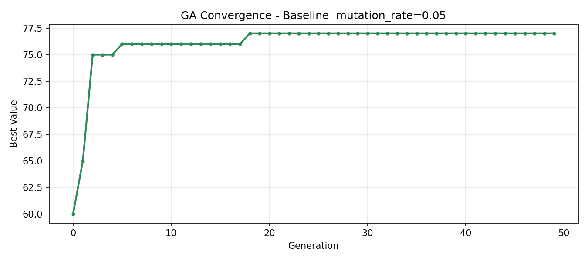

# Assignment 2 — Genetic Algorithm: Knapsack Problem
## Observation Report

**Student Name  :** _________Y.ASHRITHA VATHSALA__________________  
**Student ID    :** ____________2310040114_______________  
**Date Submitted:** ________16/3/2026___________________  

---

## How to Submit

1. Run each experiment following the instructions below
2. Fill in every answer box — do not leave placeholders
3. Make sure the `plots/` folder contains all required images
4. Commit this README and the `plots/` folder to your GitHub repo

---

## Before You Begin — Read the Code

Open `ga_knapsack.py` and read through it. Then answer these questions.

**Q1. What does the `fitness()` function return? Why does an overweight solution score 0?**

```
The fitness() function calculates the total value of the items selected in the chromosome. 
It first computes the total weight and total value of the packed items. 
If the total weight exceeds the maximum allowed weight (15 kg), the function returns 0 because the solution is invalid and cannot be used in the knapsack.
```

**Q2. What does `tournament_select()` do? Why are higher-fitness individuals more likely to be chosen?**

```
The tournament_select() function randomly selects a small group of individuals from the population and chooses the one with the highest fitness. 
Since the individual with the best fitness in that group wins the tournament, better solutions have a higher chance of being selected. 
This helps the algorithm gradually improve the population by favoring stronger individuals.
```

**Q3. Look at the `run_ga()` loop. Find this line:**
```python
next_gen = [best_chromosome[:]]
```
**What is this doing? Why is it important to always keep the best solution?**

```
This line copies the best chromosome from the current generation into the next generation. 
This technique is called elitism and ensures that the best solution found so far is not lost during crossover or mutation. 
Keeping the best individual helps the genetic algorithm maintain progress and improve results over generations.
```

---

## Experiment 1 — Baseline Run

**Instructions:** Run the program without changing anything.
```bash
python ga_knapsack.py
```

**Fill in this table:**

| Metric | Your result |
|--------|-------------|
| Number of generations |50 |
| Best value at generation 1 | 60|
| Final best value |77 |
| Total weight of best solution (kg) |14.4 |
| Is solution valid (Yes / No) |Yes |

**Copy the printed packing list here:**
```
**Experiment 1 Graph**


```

**Look at `plots/experiment_1.png` and describe what you see (2–3 sentences).**  
*Where does the biggest improvement happen? Does the curve flatten at some point?*
```
The graph shows that the best value improves quickly in the early generations. 
Most improvement happens in the first few generations as the algorithm discovers better combinations of items. 
After reaching a value around 77, the curve becomes flat, indicating the algorithm has converged to a stable optimal solution.
```

---

## Experiment 2 — Effect of Mutation Rate

**Instructions:** In `ga_knapsack.py`, find the `# EXPERIMENT 2` block in `__main__`.  
Copy it three times and run with `mutation_rate` = **0.01**, **0.05**, and **0.30**.  
Save plots as `experiment_2a.png`, `experiment_2b.png`, `experiment_2c.png`.

**Results table:**

| mutation_rate | Final best value | Weight (kg) | Valid? | Shape of curve |
|--------------|-----------------|-------------|--------|----------------|
| 0.01         |          75     |       14.9  |   YES  |  Slow improvement, early plateau              |
| 0.05         |          77     |       14.4  |   YES  | Smooth improvement, stable convergence        |
| 0.30         |          78     |       14.1  |   YES  | More fluctuations but eventually highest value|

**Compare the three plots. What happens when mutation is too low? Too high? (3–4 sentences)**  
*Hint: Too low = no diversity, may get stuck. Too high = random search. What is the sweet spot?*
```
When the mutation rate is very low (0.01), the algorithm explores fewer new solutions, so the improvement is slow and the search may get stuck in local optima. With a balanced mutation rate (0.05), the algorithm maintains diversity while still refining good solutions, leading to stable convergence. When the mutation rate is high (0.30), many genes flip randomly, which increases exploration but can also introduce instability. However, in this run it still managed to discover a slightly better solution with value 78.
```

**Which mutation_rate gave the best result? Why do you think that is?**
```
The mutation rate of 0.30 gave the best result with a final value of 78. 
This happened because the higher mutation rate introduced more diversity in the population, allowing the algorithm to explore new combinations of items and discover a better packing solution.
```

---

## Summary

**Complete this table with your best result from each experiment:**

| Experiment | Key setting | Final value | Main finding in one sentence |
|------------|-------------|-------------|------------------------------|
| 1 — Baseline|mutation_rate = 0.05 | 77  |The algorithm quickly converges to a good solution with balanced mutation. |
| 2 — Mutation rate | mutation_rate = 0.30 | 78|Higher mutation increased exploration and found a slightly better solution. |

**In your own words — what is the most important thing you learned about Genetic Algorithms from these experiments? (3–5 sentences)**
```
From these experiments, I learned that mutation rate plays an important role in the performance of a Genetic Algorithm. A very low mutation rate reduces diversity and may cause the algorithm to get stuck in local solutions. A balanced mutation rate allows both exploration and improvement of good solutions. A higher mutation rate increases exploration and can sometimes discover better solutions, but if it is too high the search can become random. Therefore, choosing an appropriate mutation rate is important for achieving good optimization results.
```

---

## Submission Checklist

- [ ] Student name and ID filled in
- [ ] Q1, Q2, Q3 answered
- [ ] Experiment 1: table filled, packing list pasted, plot observation written
- [ ] Experiment 2: results table filled (3 rows), observation and answer written
- [ ] Summary table completed and reflection written
- [ ] `plots/` contains: `experiment_1.png`, `experiment_2a.png`, `experiment_2b.png`, `experiment_2c.png`
